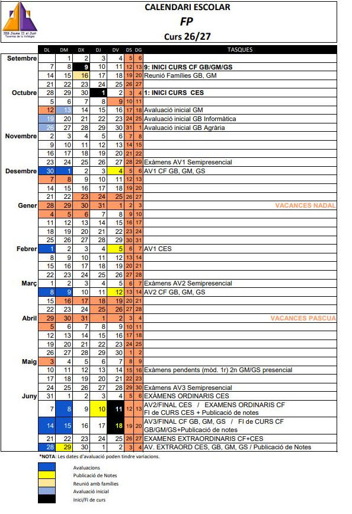

---
# Informació general del document
title: Presentació del Curs 2026-2027
subtitle: Curs d'Especialització en IA i Big Data
authors: 
    - Departament d'Informàtica
lang: ca

# Portada
titlepage: true
titlepage-rule-height: 0
# titlepage-rule-color: AA0000
# titlepage-text-color: AA0000
# logo: img/logotext.png

# Taula de continguts
toc: true
toc-own-page: true
toc-title: Continguts

# Capçaleres i peus
header-left: Presentació Curs
header-right: Curs 2026-2027
footer-left: IES Jaume II El Just
footer-right: \thepage/\pageref{LastPage}

# Imatges
float-placement-figure: H
caption-justification: centering

# Llistats de codi
listings-no-page-break: false
listings-disable-line-numbers: false

header-includes:
     - \usepackage{lastpage}
---

# Calendari escolar

* **1a Avaluació**: Octubre - Gener 2027
    * ***Festius***:
        * ***divendres, 9 d'octubre***
        * ***dilluns, 12 d'octubre***
        * ***dilluns 7 de desembre***
        * ***dimarts 8 de desembre***
        * ***dimecres 23 de desembre al dimecres 6 de gener de 2027***: Festes de Nadal.
    * ***Avaluació***: 1 de febrer de 2027
    * ***Publicació de notes***: 5 de febrer de 2027

* **2a Avaluació i final**: Febrer - Juny 2027
    * ***Festius***:
        * ***dimarts 16 de març al divendres 19 de març***: Falles.
        * ***dijous 25 de març al dilluns 5 d'abril***: Setmana Santa i Pasqua
        * ***dilluns 3 de maig***
  
* **Convocatòria ordinària**: Juny 2026
    * ***Exàmens o avaluació projectes***:
        * ***dilluns 31 maig al divendres 4 de juny ***
    * ***Avaluació***: 8 de juny 
    * ***Publicació de notes***: 10 de juny

* **Convocatòria extraordinària**: Juny 2026
    * ***Exàmens o avaluació projectes***:
        * ***dilluns 21 al dijous 24 de juny *** 
    * ***Avaluació***: 28 de juny
    * ***Publicació de notes***: 29 de juny
